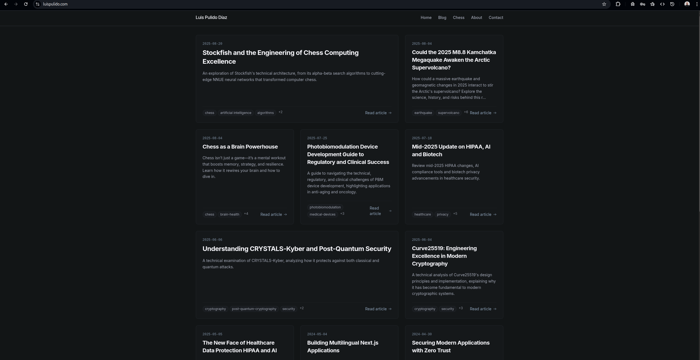
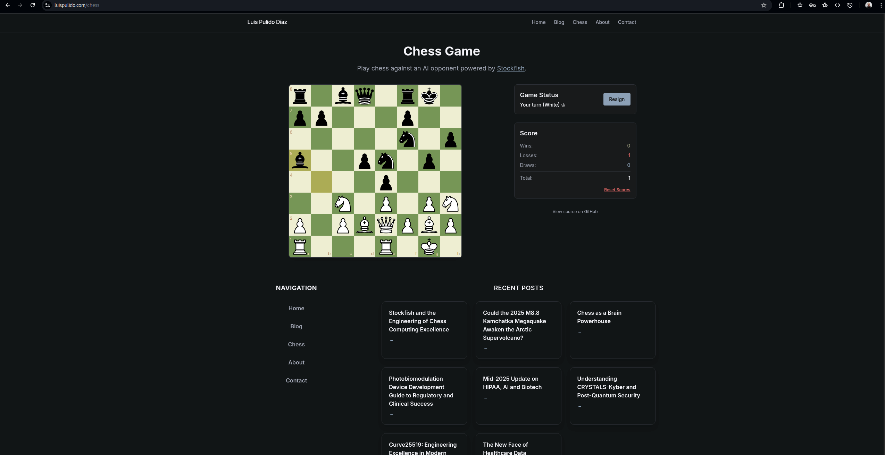

# Luis Pulido Blog

> A modern technical blog for engineers, architects, and curious minds. Explore deep dives into software architecture, security, AI, and web development, with practical guides and real-world solutions.

---

## 🚀 Features

- **Next.js 14 App Router**: Fast, scalable, and SEO-friendly
- **TypeScript**: Type-safe codebase
- **Tailwind CSS**: Custom ultradark theme, dark mode only
- **Markdown Content**: Easy authoring with frontmatter
- **Dynamic Blog & Pages**: Blog, About, Contact, Privacy, Terms, and more
- **Recent Posts & RSS**: Automated feeds and recent posts
- **Chess Section**: Interactive chessboard and game status
- **Chess Authentication**: User accounts with score persistence across devices (Custom JWT auth with reCAPTCHA)
- **Accessibility**: Minimal, distraction-free, keyboard-friendly

## 🖼️ Screenshots

Desktop:


Mobile:


Chess against AI:


*(Replace these screenshots with your own!)*

---

## 🛠️ Tech Stack

- **Framework**: Next.js 14 (App Router)
- **Language**: TypeScript
- **Styling**: Tailwind CSS
- **Authentication**: Custom JWT-based auth with Supabase database and reCAPTCHA v3
- **Database**: Supabase PostgreSQL with Row Level Security
- **Content**: Markdown, gray-matter, remark
- **Deployment**: Static export (Netlify, Vercel, GitHub Pages)

---

## ⚡ Getting Started

### Prerequisites

- Node.js >= 18.17.0
- pnpm (recommended) or npm
- Supabase account (for authentication features)

### Installation

```bash
git clone https://github.com/lpolish/luispulidocom-new-blog.git
cd blog
pnpm install # or npm install

# Set up environment variables
cp .env.example .env.local
# Edit .env.local with your Supabase credentials

pnpm dev     # or npm run dev
```

Visit [http://localhost:3000](http://localhost:3000)

### Authentication Setup

For full authentication features, see [SETUP_INSTRUCTIONS.md](./SETUP_INSTRUCTIONS.md) for detailed Supabase configuration.

---

## ✍️ Adding Content

### Create a Blog Post

1. Add a Markdown file to `src/content/posts/` (filename = URL slug)
2. Use this frontmatter:
   ```markdown
   ---
   title: "Your Post Title"
   date: "YYYY-MM-DD"
   excerpt: "Brief summary of your post"
   tags: ["tag1", "tag2"]
   isFeatured: true # Optional
   ---
   # Your Post Title
   Content goes here...
   ```
3. Write your post below the frontmatter.

### Custom Pages

- Homepage: `src/app/page.tsx`
- About: `src/app/about/page.tsx`
- Contact: `src/app/contact/page.tsx`
- Chess: `src/app/chess/page.tsx`
- Privacy/Terms: `src/app/privacy/page.tsx`, `src/app/terms-of-service/page.tsx`

---

## 🏗️ Build & Deploy

### Build

```bash
pnpm build # or npm run build
```

Static files are output to the `out` directory.

### Deploy

- **Netlify**: Build command `pnpm build`, publish directory `out`
- **Vercel**: Auto-detects Next.js
- **GitHub Pages**: Push `out` to `gh-pages` branch

---

## 📁 Project Structure

```
├── src/
│   ├── app/                # Pages & routes
│   │   ├── blog/           # Blog listing & posts
│   │   ├── chess/          # Chess section
│   │   ├── about/          # About page
│   │   ├── contact/        # Contact page
│   │   ├── privacy/        # Privacy policy
│   │   ├── terms-of-service/ # Terms of service
│   │   ├── layout.tsx      # Root layout
│   │   └── page.tsx        # Homepage
│   ├── components/         # UI & feature components
│   ├── content/            # Markdown posts
│   ├── lib/                # Utilities
│   └── hooks/              # Custom hooks
├── public/                 # Static assets
└── tailwind.config.js      # Tailwind config
```

---

## 🧩 Maintenance & Customization

- **Add Images**: Place in `public/images/`, reference as `/images/filename.png`
- **Styling**: Edit `tailwind.config.js` or component styles
- **SEO**: Update metadata in page components
- **Recent Posts/RSS**: Scripts in `scripts/` auto-generate feeds

---

## 🌐 Image Hosting Tips

- **Local**: Use `public/images/` for fastest loading
- **Alternatives**: Imgix (free tier), Imgur, GitHub repo

---

## 📜 License

MIT
