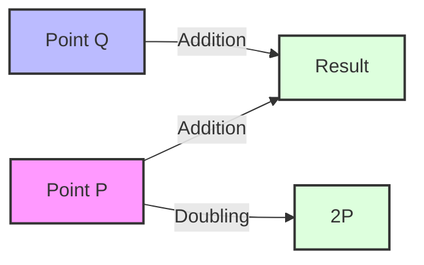
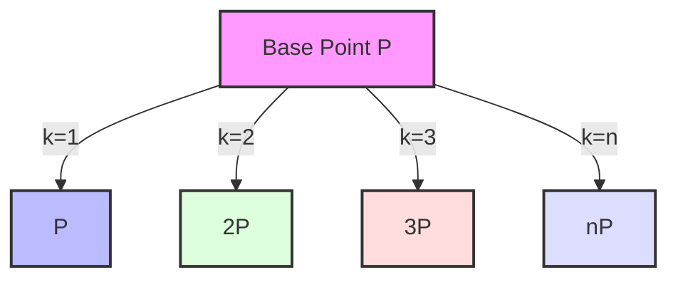
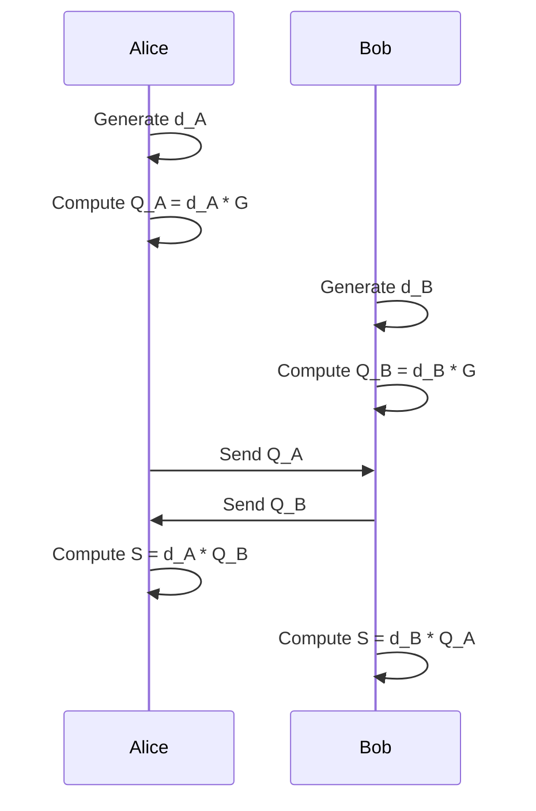
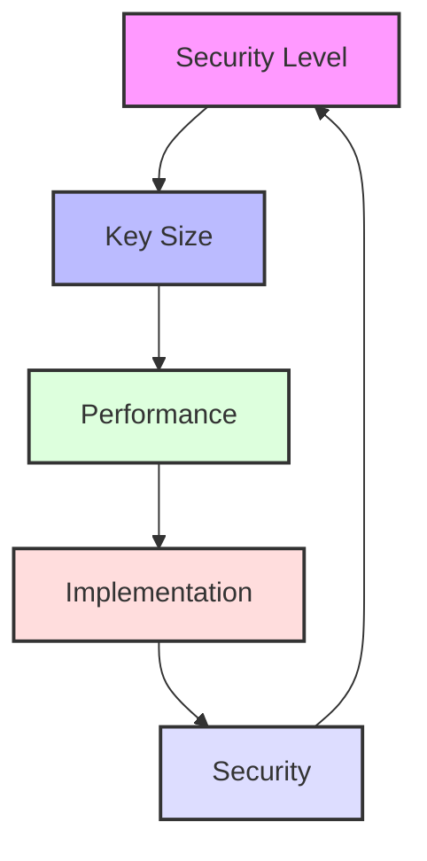
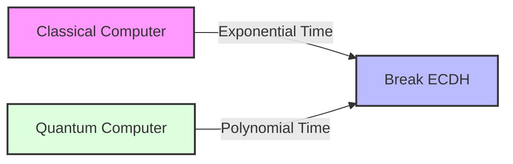
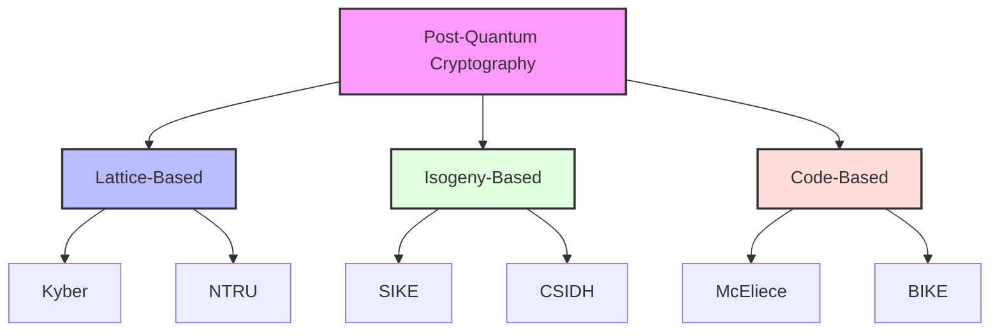

# Elliptic Curve Diffie-Hellman: Mathematical Foundations and Modern Applications

## Modern Cryptographic Landscape

ECDH has become the de facto standard for key exchange in modern cryptographic systems. Its adoption spans across:

1. **Transport Layer Security (TLS)**
   - TLS 1.3 mandates ECDH for forward secrecy
   - Widely used in HTTPS connections
   - Standard curves: x25519, x448, P-256, P-384

2. **Secure Messaging**
   - Signal Protocol's X3DH
   - WhatsApp's end-to-end encryption
   - Matrix protocol's Olm and Megolm

3. **Blockchain and Cryptocurrencies**
   - Bitcoin's secp256k1 curve
   - Ethereum's account generation
   - Monero's stealth addresses

4. **Zero-Knowledge Proofs**
   - zk-SNARKs implementations
   - Privacy-preserving protocols
   - Anonymous credentials

## Mathematical Prerequisites

### Finite Fields
A finite field (or Galois field) is a field with a finite number of elements. For ECDH, we primarily work with:
- Prime fields: GF(p) where p is a prime number
- Binary fields: GF(2^m) where m is a positive integer

### Elliptic Curves over Finite Fields
An elliptic curve E over a finite field F is defined by the Weierstrass equation:

```
y² = x³ + ax + b
```

where a, b ∈ F and 4a³ + 27b² ≠ 0 (to ensure the curve is non-singular).

```mermaid
graph TD
    A[Finite Field GF(p)] --> B[Elliptic Curve]
    B --> C[Point Addition]
    B --> D[Scalar Multiplication]
    C --> E[Group Law]
    D --> F[Key Generation]
    E --> G[Security Properties]
    F --> G
```

## Point Operations

### Point Addition
Given two points P = (x₁, y₁) and Q = (x₂, y₂) on the curve:
- If P ≠ Q:
  - λ = (y₂ - y₁)/(x₂ - x₁)
  - x₃ = λ² - x₁ - x₂
  - y₃ = λ(x₁ - x₃) - y₁
- If P = Q (point doubling):
  - λ = (3x₁² + a)/(2y₁)
  - x₃ = λ² - 2x₁
  - y₃ = λ(x₁ - x₃) - y₁



### Scalar Multiplication
Given a point P and an integer k, scalar multiplication kP is defined as:
```
kP = P + P + ... + P (k times)
```



## The ECDH Protocol

### Parameter Selection
1. Choose a finite field F
2. Select curve parameters a, b ∈ F
3. Choose a base point G of large prime order n
4. The cofactor h = |E(F)|/n should be small

### Key Generation
1. Private key: Random integer d ∈ [1, n-1]
2. Public key: Q = dG

### Key Exchange
1. Alice generates (d_A, Q_A)
2. Bob generates (d_B, Q_B)
3. They exchange public keys
4. Shared secret: S = d_AQ_B = d_BQ_A



## Security Analysis

### Hard Problems
1. **Elliptic Curve Discrete Logarithm Problem (ECDLP)**
   - Given P and Q = kP, find k
   - Best known attack: Pollard's rho algorithm with complexity O(√n)

2. **Elliptic Curve Diffie-Hellman Problem (ECDHP)**
   - Given P, aP, bP, find abP
   - No known efficient solution if ECDLP is hard

### Security Parameters
| Security Level (bits) | Field Size (bits) | Example Curves |
|----------------------|-------------------|----------------|
| 128                  | 256               | P-256, Curve25519 |
| 192                  | 384               | P-384           |
| 256                  | 521               | P-521           |



## Post-Quantum Considerations

### Quantum Threat Model
1. **Shor's Algorithm**
   - Polynomial-time solution for ECDLP
   - Theoretical threat to ECDH
   - Estimated quantum resources required



2. **Grover's Algorithm**
   - Quadratic speedup for brute force
   - Impact on key sizes
   - Mitigation strategies

### Post-Quantum Alternatives

1. **Lattice-Based Cryptography**
   - NTRU
   - Kyber (NIST PQC Standard)
   - CRYSTALS-Kyber
   - Performance characteristics
   - Implementation challenges

2. **Isogeny-Based Cryptography**
   - SIKE (Supersingular Isogeny Key Encapsulation)
   - CSIDH
   - Advantages in key sizes
   - Current research status

3. **Code-Based Cryptography**
   - Classic McEliece
   - BIKE
   - HQC
   - Implementation considerations



## Implementation Considerations

### Curve Selection
1. **NIST Curves**
   - P-256, P-384, P-521
   - Well-documented but concerns about NIST's role in standardization

2. **Alternative Curves**
   - Curve25519: Designed for performance and security
   - Brainpool curves: Developed by German standards body

### Side-Channel Attacks
1. **Timing Attacks**
   - Implement constant-time scalar multiplication
   - Use Montgomery ladder for point multiplication

2. **Power Analysis**
   - Implement point blinding
   - Use randomized projective coordinates

## Protocol Integration

### TLS 1.3
1. Supported curves: x25519, x448, P-256, P-384, P-521
2. Key exchange: Ephemeral ECDH (ECDHE)
3. Authentication: ECDSA or EdDSA

### Signal Protocol
1. X3DH: Extended Triple Diffie-Hellman
2. Double Ratchet: Combines ECDH with hash ratchets
3. Perfect forward secrecy through ephemeral keys

## Performance Optimization

### Point Representation
1. **Affine Coordinates**
   - (x, y) format
   - Requires field inversion

2. **Projective Coordinates**
   - (X, Y, Z) format
   - Avoids field inversion
   - Faster point operations

### Implementation Techniques
1. **Window Methods**
   - Fixed window
   - Sliding window
   - Comb method

2. **Parallel Computation**
   - SIMD operations
   - Multi-core processing

## Modern Deployment Patterns

### Cloud-Native Implementations
1. **Hardware Acceleration**
   - Intel SGX enclaves
   - AWS Nitro Enclaves
   - Google Cloud Confidential Computing

2. **Edge Computing**
   - IoT device constraints
   - Resource optimization
   - Security considerations

3. **Serverless Architectures**
   - Cold start optimization
   - Stateless key management
   - Performance trade-offs

### Security Best Practices

1. **Key Management**
   - Hardware Security Modules (HSM)
   - Key rotation policies
   - Key escrow considerations

2. **Protocol Hardening**
   - TLS 1.3 configuration
   - Curve selection guidelines
   - Implementation validation

3. **Monitoring and Auditing**
   - Key usage tracking
   - Anomaly detection
   - Compliance requirements

## Future Directions

1. **Standardization Efforts**
   - NIST Post-Quantum Cryptography Project
   - IETF Working Groups
   - Industry Consortiums

2. **Research Frontiers**
   - New curve designs
   - Implementation optimizations
   - Security proofs

3. **Industry Adoption**
   - Migration timelines
   - Training requirements
   - Cost considerations

## Standards and Specifications

1. **NIST Standards**
   - FIPS 186-4: Digital Signature Standard
   - SP 800-56A: Key Agreement

2. **IETF Standards**
   - RFC 7748: Elliptic Curves for Security
   - RFC 8446: TLS 1.3

## Further Reading

1. **Academic Papers**
   - [The Arithmetic of Elliptic Curves](https://link.springer.com/book/10.1007/978-0-387-09494-6) by Joseph H. Silverman
   - [Guide to Elliptic Curve Cryptography](https://link.springer.com/book/10.1007/b97644) by Darrel Hankerson et al.
   - [Post-Quantum Cryptography](https://link.springer.com/book/10.1007/978-3-540-88702-7) by Daniel J. Bernstein et al.

2. **Standards Documents**
   - [NIST SP 800-56A Rev. 3](https://nvlpubs.nist.gov/nistpubs/SpecialPublications/NIST.SP.800-56Ar3.pdf)
   - [RFC 7748: Elliptic Curves for Security](https://tools.ietf.org/html/rfc7748)
   - [NIST PQC Project](https://csrc.nist.gov/projects/post-quantum-cryptography)

3. **Implementation Guides**
   - [SafeCurves: choosing safe curves for elliptic-curve cryptography](https://safecurves.cr.yp.to/)
   - [The Curve25519-donna implementation](https://github.com/agl/curve25519-donna)
   - [Open Quantum Safe](https://openquantumsafe.org/) 